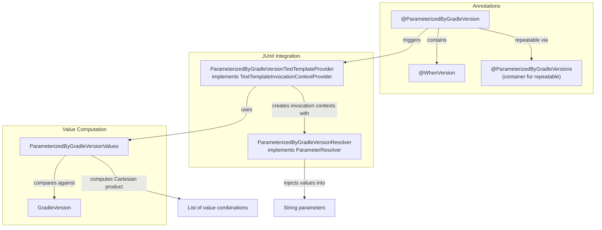

Add @ParameterizedByGradleVersion for version-conditional test parameters

## Before this PR

When testing Gradle plugins across multiple versions, tests often need different behavior based on the Gradle version. Previously, this required maintaining separate test methods for different version ranges.

## After this PR

Introduces `@ParameterizedByGradleVersion` - an annotation that injects String parameters based on the Gradle version under test. This works similarly to JUnit's `@ValueSource`, but selects values based on version conditions.

**Usage:**
```java
@ParameterizedByGradleVersion(
    value = @WhenVersion(lessThan = "9.0", value = {"option1", "option2"}),
    otherwise = "default")
void test(GradleInvoker gradle, RootProject project, String option) {
    // For Gradle < 9.0: runs twice with "option1" and "option2"
    // For Gradle >= 9.0: runs once with "default"
}
```

**Multiple annotations** create a Cartesian product:
```java
@ParameterizedByGradleVersion(value = @WhenVersion(lessThan = "8.0", value = "legacy"), otherwise = "new")
@ParameterizedByGradleVersion(value = @WhenVersion(lessThan = "8.0", value = {"1", "2"}), otherwise = "4")
void test(GradleInvoker gradle, RootProject project, String feature, String maxWorkers) {
    // For Gradle < 8.0: (legacy, 1), (legacy, 2) - 2 invocations
    // For Gradle >= 8.0: (new, 4) - 1 invocation
}
```

**Note:** Only String parameters are supported for now. Additional types (int, boolean, etc.) can be added later if needed.

**Positional injection:** Values are injected positionally into String parameters, similar to JUnit's `@ValueSource`.

**No `greaterThan` condition:** We deliberately only provide `lessThan`, `lessThanOrEqualTo`, and `equalTo`. This design enables automated cleanup - when minimum Gradle version is bumped, an Error Prone check can identify and remove version conditions that are no longer reachable, simplifying tests over time.

**Strings only (for now):** We've started with String parameters to keep the implementation simple. Other types can be added later if there's demand.

**TestTemplate over disabled tests:** We use JUnit's `@TestTemplate` mechanism rather than `@ParameterizedTest` with disabled invocations. This means we only generate test invocations for values that actually match the current Gradle version - no skipped/disabled tests cluttering the output. The number of test invocations adapts dynamically based on which conditions match.

### Architecture



**Flow:**
1. JUnit discovers `@ParameterizedByGradleVersion` and calls `ParameterizedByGradleVersionTestTemplateProvider`
2. Provider uses `ParameterizedByGradleVersionValues` to compute matching values for the current Gradle version
3. For each value combination (Cartesian product if multiple annotations), an invocation context is created
4. Each context includes a `ParameterizedByGradleVersionResolver` that injects values positionally into String parameters

## Possible downsides?

- Only supports String parameters currently - other types would need to be added in follow-up work
- Methods using this annotation should not also use `@Test` as it includes `@TestTemplate`
